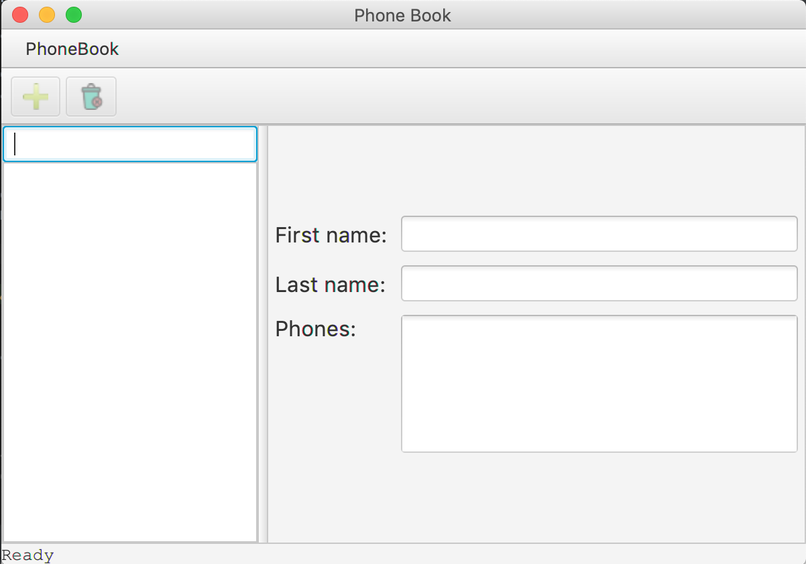
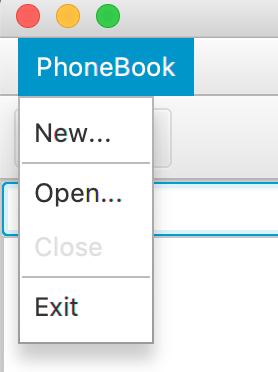
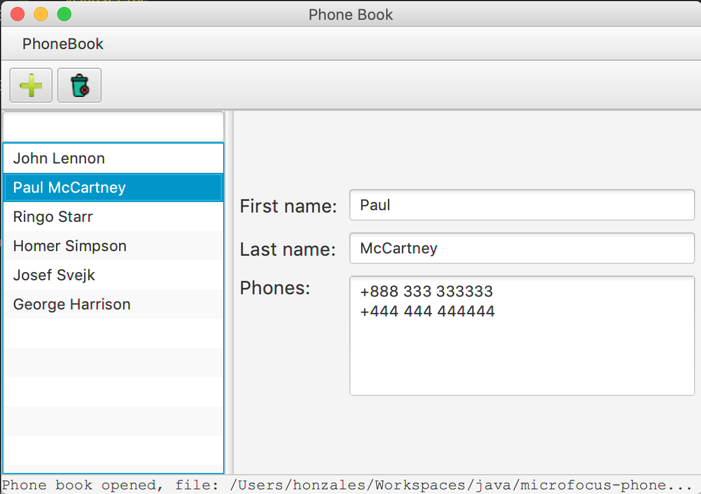
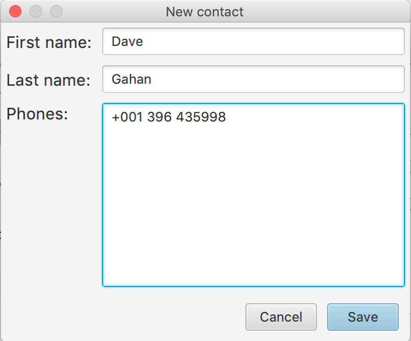
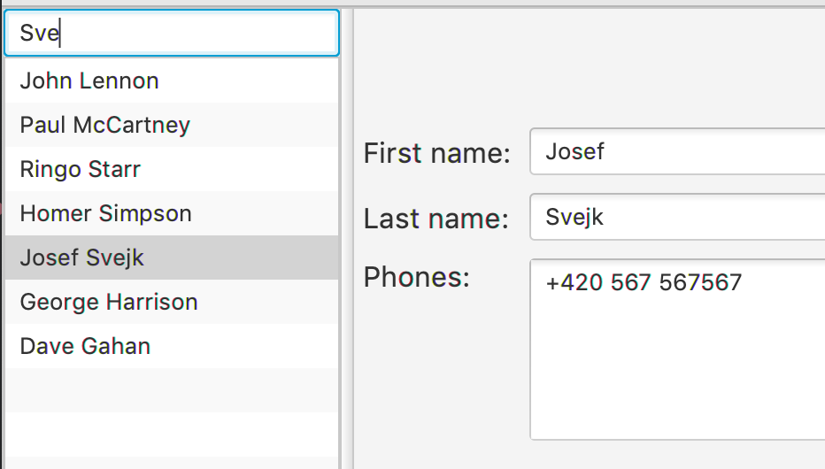

# PhoneBook

PhoneBook is an application developed by Jan Lastovicka as a task from Micro Focus. 

This application allows managing contacts:

* open existing phone book
* create new phone book
* list all contacts
* create new contact
* remove existing contact

## Application

Phone book is a desktop application, written in Java language, using JavaFX
library as UI framework, storing contacts into external XML file.

Basic flow is as follow:

* User opens a phone book
* User adds/removes contacts
* User closes the phone book
* User creates a new phone book
* User adds/removes contacs 
* ...


When the application is launched, following window appears: 



To start working with contacts, the user has two options:

* open an existing phone book XML file
* create a new phone book XML file

This can be accomplished by menu:



By selecting either **New...** or **Open...**. In both cases, a common file dialog
opens to choose an existing file or to define a new file. If the user chooses an
existing file, the application gets populated: 




Now the user can perform following operations:

* view contact detail
* create a new contact
* delete an existing contact
* search an existing contact

#### View detail

To see a detail of a contact, the user can simply select a name of a person
from the list on the left, and a detail of the person's contact is displayed
in the detail view on the right.

#### New contact

The toolbar provides a button for adding a new contact (plus sign). By clicking
on it, a new dialog appears:



where the user has to fill in all the fields. In case that any of them 
is not valid, it is not allowed to save the contact. These are the rules:

** first name must not be empty
** last name must not be empty
** phone numbers must be each on separate line, in format +XXX XXX XXXXXX where X is a digit

If all the fields are valid, a new contact is saved in XML file and visible in the list of
all contacts.

#### Delete contact

For deleting an existing contact, the user can use a toolbar button (dustbin). By clicking
on it, the selected contact disappears from the list of contact as well as from
source XML file.

#### Search contact

The PhoneBook application allows searching for contacts by typing in the text field
above list of contact. As user types, the application tries to find the first contact
that contains the inserted text and select its detail.



#### XML file

To play with the application, I prepared an example XML file with several contacts, saved in
the root directory of the repo - **contacts.xml**.

Phone book reads and stores data in XML file in the following format:

```
 <contacts>
   <contact>
     <id>00000000-0000-0000-0000-000000000001</id>
     <name>John Lennon</name>
     <number>+222 111 111111</number>
     <number>+989 222 222222</number>
     <number>+333 313 131313</number>
   </contact>
   <contact>
     <id>00000000-0000-0000-0000-000000000002</id>
     <name>Paul McCartney</name>
     <number>+888 333 333333</number>
     <number>+444 444 444444</number>
   </contact>
   <contact>
     <id>00000000-0000-0000-0000-000000000004</id>
     <name>Ringo Starr</name>
     <number>+343 777 777777</number>
   </contact>
   <contact>
     <id>00000000-0000-0000-0000-000000000003</id>
     <name>George Harrison</name>
     <number>+001 555 555555</number>
   </contact>
 </contacts>
 ```
 
As user works with contacts (adds/removes), the XML file is updated automatically. 
 
 
## How to run

**As a client**

* Java 8 must be installed. To check, write on command line: `java -version`
* Download file `PhoneBook-1.0.jar` from this repo
* run `java -jar PhoneBook-1.0.jar`


**As a developer**

* Maven must be installed. To check, write on command line: `mvn --version`
* Java 8 must be installed. To check, write on command line: `java -version`
* Clone this repository from GitHub
* run `mvn clean install` in the root directory containing `pom.xml`
* run `java -jar PhoneBook-1.0.jar`

to run tests
* run `mvn clean test` in the root directory of the repo.


## Design and architecture

#### Persistence
I chose XML format as a persistence storage and XStream library as a persistence framework.

**Why**: if we consider the application to be used on a daily basis, it makes sense to have
contacts in some readable and easily consumable format, which XML surely is. 

**Advantage**: We can export 
the contact list to any other format with help of XSLT transformation for instance. Or
edit contacts directly. Another advantage is the we can have several XML files (colleagues.xml, friends.xl etc.).
This solution seemed to me better than using some heavy DB framework
like JPA etc. 

**Disadvantage**: In case we have lot of contacts (thousands), the performance might suffer since the list of contact is
flushed to this file always when one is removed or added. I understood that this application is designed for personal usage
where there is not thousands of contacts.

#### Backend

I chose **DDD** (Domain Driven Design) approach since this architecture offers clean
separation of concerns like repositories, entities, value classes etc. I like this
architecture because it also forces you to adhere some rules that should be kept
and allows the code to be more organized and newcomer can easily start working on
the project.


#### Frontend
I chose JavaFX graphical library that is part of Java language.
**Why**: Even though I am a big a fan of command line tools, if I consider this application to be
used frequently and quickly, then it makes me more sense to have some simple UI interface,
to have simple desktop application that I can quickly start just be clicking on its icon
on my desktop and quickly find what I am currently looking for. 

**Other options**: Thanks to the chosen architecture
it should not be a big issue to enhance the application to have also command line interface. All the backend logic
is hidden behind **PhoneBookService** (see below). 

These are core classes of the application. I omitted frontend.


As mentioned earlier, the architecture follows DDD. 

**Contact** is an aggregate entity. It represents the smallest persistence unit, having all 
information in it to describe a contact - name and phone numbers. It is an entity that is
identified by its id (which is not persistence id). It is not allowed to get name or phone numbers
directly without contact. Contact is the root of the object structure to obtain from persistence
repository.

**ContactId** it is a unique identifier of the Contact entity. It is the only value
that uniquely identifies a contact. It is a value object.

**ContactName** it is a value class that serves as a container for first name and last name of a contact, like John Doe etc. 
From DDD perspective, this class is a value class that describes the owning entity - Contact. 

**PhoneNumber** similarly like ContactName, this class is a value class that is owned by
Contact, storing one phone number that must conform to a pattern +XXX XXX XXXXXX where X is
a digit. An owning entity Contact contains one or more phone numbers.

**ContactDescriptor** describes a contact, it is a value class that does not provide new value,
but rather provides combination of existing ones - contact id and name. The reason why this value
class exists is that we need a means of lightweight contact for displaying name and identifying
the aggregate Contact at the same time. 

**ContactsRepository** is a DDD concept that works with Contact aggregate. It represents a collection
of contacts no matter whether they are held in memory, or stored in some persistence storage.
It is just an interface for obtaining and storing contacts.

**PhoneBookService** is an application service that contains methods representing use cases
performed by the user. From DDD perspective, this application service coordinates DDD objects
like repository, aggregates etc. This class is an entry point to the application backend.
All the UI infrastructure accesses backend only via this class.

**XmlContactRepository** is an implementation of ContactsRepository that does IO operations
with XML file as a storage. This class has responsibility to work with XML file. It does not do it directly
but rather it uses XmlFileProcessor (abstract class) that reads and saves all contacts (XStreamContactXmlProcessor) 
with hel of XStream library. In order to improve performance, a decorator (CachingContactXMLProcessorDecorator) has
been introduced that caches the contacts and reloads them from file in cas the file has been modified. The advantage
is that if someone modifies the file externally, the application can quickly reflect this information.


 ## Testing
 
 As a testing framework I chose **TestNG** which is my favourite framework and I have a lot
 of experience with it. There are two groups of tests:
 
 * unit tests
 * function tests
 
 Since the application is small and easy, I guess most of the features (all?) are tested.
 
 ### Unit Tests
 I developed uni tests of XmlContactRepository (stored in `src/test/java/.../unit/XmlContactRepositoryTest`). I needed
 to develop these tests during development because I wanted to make sure it works and it is
 very straightforward and easy to by sure this part is working well.
 
 ### Functional Tests
 I developed functional tests that test PhoneBookService as a whole. It means that these tests
 test the whole logic of the application. This whole backend (stored in `src/test/java/.../functional/PhoneBookServiceTest`).
 
 I focused on several classic use cases like:
 
 * open existing phone book
 * add new contacts
 * find contacts by name
 
 OR 
 
 * open existing phone book
 * read contacts
 * add new contacts
 
 OR 
 
 * create new phone book
 * create new contacts
 * read these contacts
 
 ### What is missing
 I believe there should have been a functional test that would test the application backend (PhoneBookService)
 and check an XML file whether it really contains what it should contain.
 
 There is no end-to-end test, I found some libraries how to test a JavaFX application as a whole.
 For example RobotFramework seems to be an appropriate one, but I did not have enough time to play
 with it. 

 More negative tests like adding new null contacts, etc.
 
 
 ### Reporting
 TestNG generated HTML formatted report. This report could be further deployed etc. For now
 it is sufficient to see graphical representation of the tests. 
 
 
 
 
There is also XML report generated by TestNG. Based in CI tool it is possible to configure the tool to fetch this XML and 
visualize the test suites results in a better way as well as notify developers/QA engineers by e-mail about the result. I
worked with TeamCity CI where it was possible to configure various ways of notification about results.
 
 