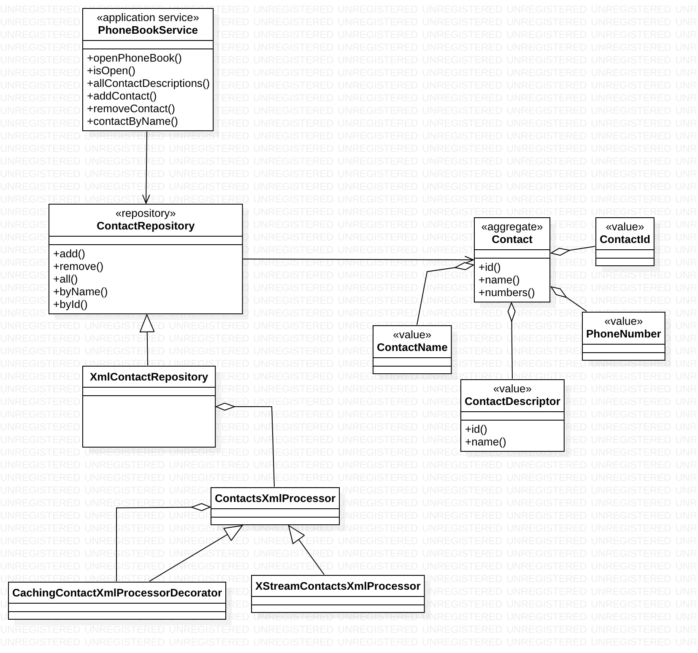

# PhoneBook

PhoneBook is an application developed by Jan Lastovicka as a task from Micro Focus. 

This application allows managing contacts:
* open existing phone book
* create new phone book
* create new contact
* remove existing contact

##How to run

**As a client**
Prerequisities:
* Java 8 installed. To check, write on command line: `java -version`

* Download file `phonebook.jar` from this repo
* run `java -jar phonebook.jar`


**As a developer**
Prerequisities: 
* Maven installed. To check, write on command line: `mvn --version`
* Java 8 installed. To check, write on command line: `java -version`

* Clone this repository from GitHub
* run `mvn clean install` in the root directory containing `pom.xml`
* run `java -jar phonebook.jar`


## Design consideration

### persistence
I chose XML file as a persistence storage and XStream library as a persistence framework.
**Why**: if we consider the application to be used on a daily basis, it makes sense to have
contacts in some readable and easily consumable format, which XML surely is. We can export 
the contact list to any other format with help of XSLT transformation for instance. Of
edit contacts directly. This solution seems to me better than using some heavy DB framework
like JPA etc.

### backend
I chose **DDD** (Domain Driven Design) approach since this architecture affers clean
separation of concerns like repositoris, entities, value classes etc. I like this
architecture because it also forces you to adhere some rules that should be kept
and allows the code to be more organized and newcomer can easily start working on
the project.

### frontend
I chose JavaFX graphical library that is part of Java language.
**Why**: Even though I am a big a fan of command line tools, if I consider this application to be
used frequently and quickly, then it makes me more sense to have some simple UI interface,
to have simple desktop application that I can quickly start just be clicking on its icon
on my desktop and quickly find what I am currently looking for. 


## Architecture



**Contact** is an aggregate entity. It represents the smallest persistence unit, having all 
information in it to describe a contact - name and phone numbers. It is an entity that is
identified by its id (which is not persistence id).


**ContactId** it is a unique identifier of the Contact entity. It is a value object.

**ContactName** it is a value class that serves as a name of a contact, like John Doe etc. 
It consists of two parts - first name and last name. From DDD pespecive, this class is a value
class that describes the owning entity - Contact.

**PhoneNumber** similarly like ContactName, this class is a value class that is owned by
Contact, storing one phone number that must conform to a pattern +XXX XXX XXXXXX where X is
a digit. An owning entity Contact contains one or more phone numbers.

**ContactDescriptor** describes a contact, it is a value class that can bu used as a sort
description of a contact without numbers.

**ContactsRepository** is a DDD concept that works with Contact aggregate. It represents a collection
of contacts no matter whether they are held in memory, or stored in some persistence storage.
It is just an interface for obtaining and storing contacts.

**PhoneBookService** is an application service that contains methods representing use cases
perfomed by the user. From DDD perspecive, this application service coordinates DDD objects
like repository, aggreagates etc. This class is an entry point to the application backedn from UI.
All the UI infrastructure accesses backend only via this class.

**XmlContactRepository** is an implementation of ContactsRepository that does IO operations
with XML file as a storage.


##Application

Phone book reads and stores data in following format:

```
 <contacts>
   <contact>
     <id>00000000-0000-0000-0000-000000000001</id>
     <name>John Lennon</name>
     <number>+222 111 111111</number>
     <number>+989 222 222222</number>
     <number>+333 313 131313</number>
   </contact>
   <contact>
     <id>00000000-0000-0000-0000-000000000002</id>
     <name>Paul McCartney</name>
     <number>+888 333 333333</number>
     <number>+444 444 444444</number>
   </contact>
   <contact>
     <id>00000000-0000-0000-0000-000000000004</id>
     <name>Ringo Starr</name>
     <number>+343 777 777777</number>
   </contact>
   <contact>
     <id>00000000-0000-0000-0000-000000000003</id>
     <name>George Harrison</name>
     <number>+001 555 555555</number>
   </contact>
 </contacts>
 ```
 
 This example implies that a contact can contain one or more phone numbers.
 
